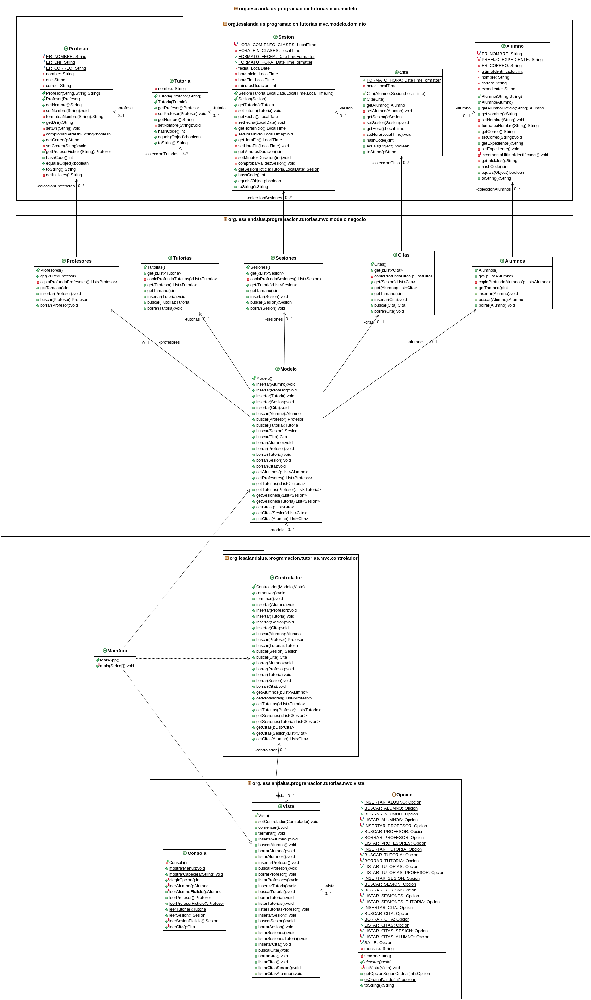

# Tarea: Tutorías IES Al-Ándalus
## Profesor: José Ramón Jiménez Reyes
## Alumno: Jesús Salazar Fenoy

Desde el IES Al-Ándalus nos acaban de comentar que por favor eliminemos la restricción de tamaño en los datos de la aplicación. Por lo que decidimos utilizar estructuras dinámicas de datos, en concreto `Listas`. Para las diferentes clases del modelo que contienen las colecciones de objetos del dominio (las que están incluidas en el paquete `negocio`) deberemos sustituir los `Array` por `ArrayList` y, cómo no, ajustar los diferentes métodos para que sigan haciendo lo mismo que antes, pero utilizando las nuevas estructuras de datos. Como observarás, los métodos privados que teníamos antes desaparecen ya que ahora no serán necesarios.

También nos han comentado que si podemos hacer que los listados que muestra la aplicación se muestren siguiendo un determinado orden. En concreto nos piden:

- Los alumnos se ordenarán por su correo.
- Los profesores se ordenarán por su DNI.
- Las tutorías se ordenarán por profesor y por el nombre de la tutoría. Cuando se listen las tutorías de un profesor se mostrarán ordenadas por nombre de la tutoría.
- Las sesiones se ordenarán por tutoría y por fecha. Cuando se listen las sesiones de una tutoría se mostrarán ordenadas por fecha de la sesión.
- Las citas se ordenarán por sesión y por hora de la sesión. Cuando se listen las citas de una sesión se mostrarán ordenadas por hora de la sesión. Cuando se listen las citas de un alumno se mostrarán ordenadas por sesión y por hora de la sesión.

También nos han pedido que tengamos en cuenta algunas restricciones de integridad:

- Al insertar una tutoría deberemos comprobar que el profesor de la tutoría existe e insertar la tutoría para el profesor encontrado.
- Al insertar una sesión deberemos comprobar que la tutoría de la sesión existe e insertar la sesión para la tutoría encontrada.
- Al insertar una cita deberemos comprobar que la sesión de la cita existe y que el alumno de la cita también existe e insertar la cita para la sesión y el alumno encontrados.
- Al borrar un alumno deberemos borrar todas las citas asociadas al mismo.
- Al borrar una sesión deberemos borrar todas las citas asociadas a la misma.
- Al borrar una tutoría deberemos borrar todas las sesiones (en cascada) asociadas a la misma.
- Al borrar un profesor deberemos borrar todas las tutorías (en cascada) asociadas al mismo.

El diagrama de clases queda como te muestro a continuación y poco a poco te iré explicando los diferentes pasos a realizar:

En este repositorio de GitHub hay un esqueleto de proyecto gradle que ya lleva incluidos todos los test necesarios que el programa debe pasar. 

Por tanto, tu tarea va a consistir en completar los siguientes apartados:

1. Lo primero que debes hacer es realizar un `fork` del repositorio donde he colocado el proyecto gradle con la estructura del proyecto y todos los test necesarios. Clona tu repositorio remoto recién copiado en github a un repositorio local que será donde irás realizando lo que a continuación se te pide. Añade tu nombre al fichero `README.md` en el apartado "Alumno". Copia los ficheros del directorio `src/main/java` de tu tarea anterior al repositorio local. Realiza tu primer commit.
2. Refactoriza la clase `Alumno` (y todas las necesarias para que todo siga funcionando igual) para que utilice `ArrayList` en vez de `Arrays`. Realiza un commit.
3. Refactoriza la clase `Profesor` (y todas las necesarias para que todo siga funcionando igual) para que utilice `ArrayList` en vez de `Arrays`. Realiza un commit.
4. Refactoriza la clase `Tutoria` (y todas las necesarias para que todo siga funcionando igual) para que utilice `ArrayList` en vez de `Arrays`. Realiza un commit.
5. Refactoriza la clase `Sesion` (y todas las necesarias para que todo siga funcionando igual) para que utilice `ArrayList` en vez de `Arrays`. Realiza un commit.
6. Refactoriza la clase `Cita` (y todas las necesarias para que todo siga funcionando igual) para que utilice `ArrayList` en vez de `Arrays`. Realiza un commit.
7. Haz que el método `get` de la clase `Alumnos`  se adecúe a la ordenación pedida en los requisitos. Realiza un commit.
8. Haz que el método `get` de la clase `Profesores` se adecúe a la ordenación pedida en los requisitos. Realiza un commit.
9. Haz que los métodos `get` de la clase `Tutorias` se adecúe a la ordenación pedida en los requisitos. Realiza un commit.
10. Haz que los métodos `get` de la clase `Sesiones` se adecúe a la ordenación pedida en los requisitos. Realiza un commit.
11. Haz que los métodos `get` de la clase `Citas` se adecúe a la ordenación pedida en los requisitos. Realiza un commit.
12. Haz que en la clase `Modelo` se cumplan todas las restricciones de integridad pedida en los requisitos. Revisa que tu código pasa todas las pruebas. Realiza el último commit y sube los cambios a tu repositorio remoto en GitHub.

###### Se valorará:
- La indentación debe ser correcta en todas las clases.
- El nombre de las variables debe ser adecuado.
- Se debe utilizar la clase `Entrada` para realizar la entrada por teclado.
- El proyecto debe pasar todas las pruebas que van en el esqueleto del mismo y toda entrada del programa será validada para evitar que el programa termine abruptamente debido a una excepción.
- Se valorará la corrección ortográfica tanto en los comentarios como en los mensajes que se muestren al usuario.
